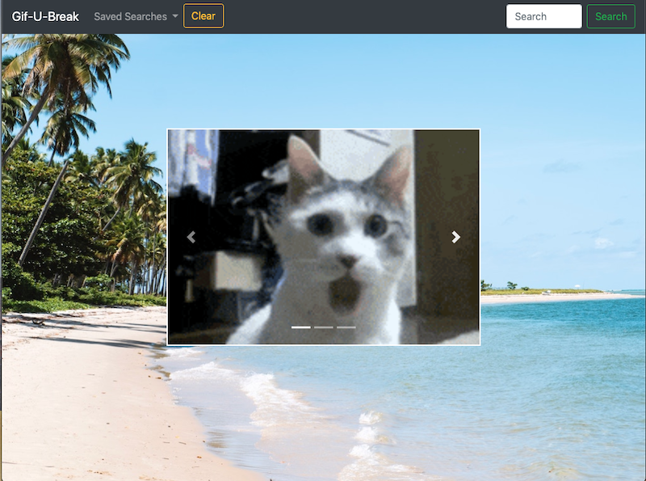
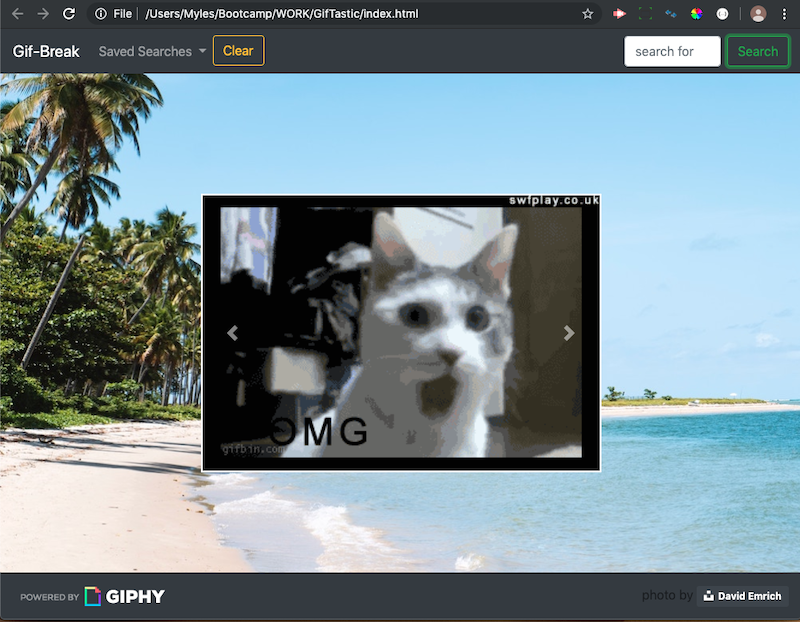
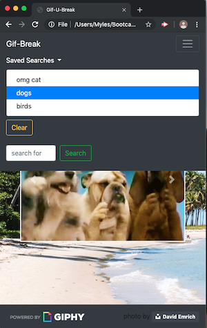

# GifTastic

Gif Retrieval Web Page

## Description
 
This page retrieves Gif using the Gihpy API.  The user enters a search term such as 'cats'
and 10 Gifs will be loaded into a carousel display.  

Search terms are saved in a dropdown list and local storage for device persistance.
A clear button allows all saved searches to be removed.

The current Gif search is highlighted in the dropdown list and is remembered on page reload.

There is a modal form with instructions that displays if the page finds no saved searches 
in local storage on page load.

This page was created using HTML, CSS, Bootstrap, Javascript, JQuery, Bootstrap and the Giphy API.

## Deployed Page:
https://mylescarey2019.github.io/GifTastic/

Instruction modal:

Gif page:

Mobile - showing collapsable menu:

## Getting Started

### Dependencies

* none - responsive design usable on phone, table, laptop or desktop

### Installing

* none necessary - use browser to play

### Executing program

* open in browser and follow instructions
*   1. enter search terms
    2. Use arrow controls to cycle thru the 10 retrieved Gifs
    3. Search terms are saved in drop-down for reuse
    2. Use Clear button to remove all saved searches
    

## Help

For further development details see [UseCases and Psuedo Code](UseCases-PsuedoCode.md)

## Authors

Myles Carey 
mylescarey2019@gmail.com 

## Version History
 
* 0.1
    * Initial Release

## License

## Acknowledgments

Thanks to beta testers - my 15yo & 17yo daughters and wife 
