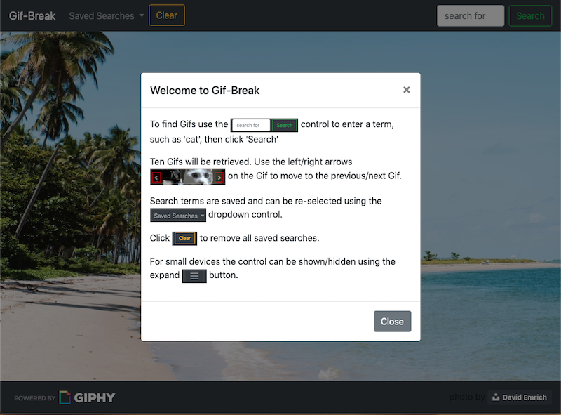

# GifTastic

Gif Retrieval Web Page

## Description
 
This page retrieves Gif using the Gihpy API.  The user can select from several predifined animaly topics.
Selecting a topic will load multiple Gifs from the Gihpy API related to the topic.

The users can also add the the list of topics via a search box.

Topics are selectable via a header bar dropdown box.  

///// finish read me detail below

## Getting Started

### Dependencies

* none - responsive design usable on phone, table, laptop or desktop

### Installing

* none necessary - use browser to play

### Executing program

* open in browser and follow instructions
*   1. click on unordered list of possible answers for each question
    2. play another set of 10 questions after completing one
    3. option to re-play all sets of questions after they have been completed
    

## Help

For further development details see [UseCases and Psuedo Code](UseCases-PsuedoCode.md)

## Authors

Myles Carey 
mylescarey2019@gmail.com 

## Version History
 
* 0.1
    * Initial Release

## License

## Acknowledgments

Thanks to beta testers - my 15yo & 17yo daughters and wife 
